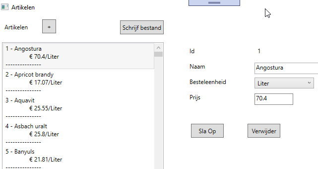

# Artikelen bewerken

## Klasse Artikel
Een artikel heeft 
- een uniek id (groter dan 1). 
- een naam (minimum 2 letters)
- een eenheid
- een prijs (tussen 0,01 en 1000 euro)

Zorg ervoor dat een artikel weergegeven wordt zoals te zien in de listbox op de screenshot.

## ArtikelService (m.b.v. TextFileStreams.Lib ==> zie verder)
In de artikelservice kan een bestand ingeladen worden (zoals te vinden in de map Assets) en omgezet in een List<Artikel>.

Voorzie alle CRUD-operations, eventueel met de nodige bijkomende methodes om ze te kunnen uitvoeren.

Voorzie ook een methode om een bestand aan te maken op basis de List<Artikel>. 

## TextFileStreams
### ReadService
Voorzie hier code om
- Een tekstbestand in te lezen naar een string
- Een tekstbestand in te lezen naar een List<string>
- Een tekstbestand in te lezen naar een List<string[]>

In deze klasse zijn er ook twee properties die het pad geven naar de map waar de exe zich bevindt en naar de map 'Documenten'.

### WriteService
Voorzie hier code om een tekstbestand te schrijven
- op basis van een string
- op basis van een List<string>
- op basis van een List<string[]>

Voorzie daarnaast code om een List<string[]> om te zetten naar een list van csv-strings
## Code behind
Voorzie de nodige code om het bestand Artikelen.csv in te laten lezen via de klasse ArtikelService en toon de artikelen in de listbox.

Zorg ervoor dat alle CRUD-operations uitgevoerd kunnen worden. Bij een fout wordt er een boodschap weergegeven in tbkFeedback.

